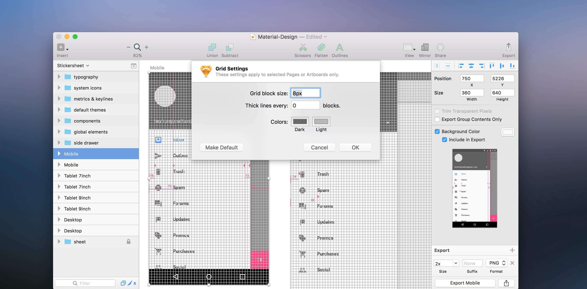
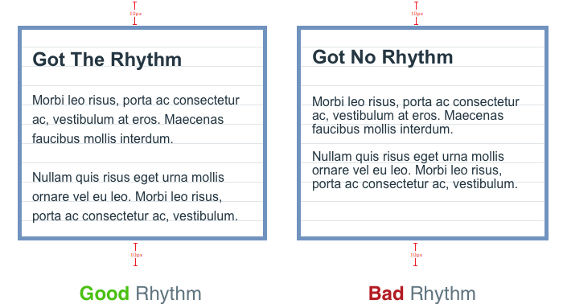
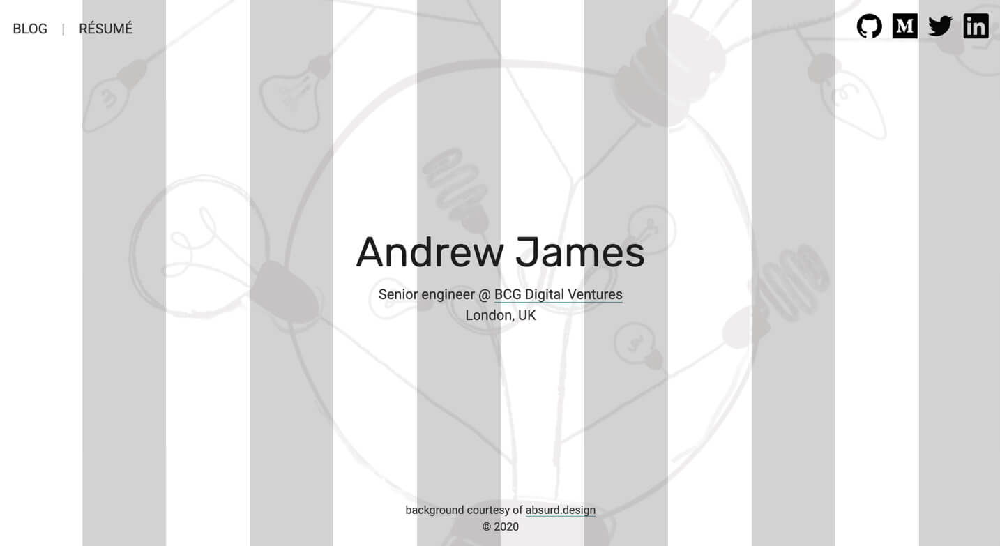
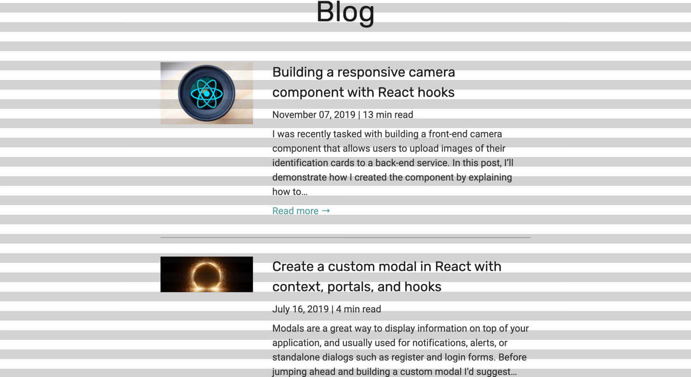

One of my favourite talks to come out of ReactFest London was Siddharth Kshetrapal's [presentation on the frontend workflow](https://www.youtube.com/watch?v=bLgZwFRYTJ4). As he explained that design systems can fall short due to miscommunication amongst the project disciplines, I was reminded of a similar experience with a designer on a React project. We were discussing the inconsistencies in vertical rhythm between his design and the application’s frontend build. To illustrate his point, he opened the design in Sketch and enabled the grid view.

<figure>
	
  <figcaption>1.1: Sketch's design grid</figcaption>
</figure>

Sketch’s grid is a visual overlay allowing designers to create a high precision layout. I assumed that constant spacing between components would result in consistent vertical rhythm, yet the demonstration highlighted that despite the components being evenly distributed on the page, their respective content was not.

<figure>
	
  <figcaption>1.2: Vertical rhythm example</figcaption>
</figure>

Since the application was designed with a grid overlay, I put together a similar treatment for the frontend by adding a styled component to the application root. The grid will sit on top of the entire application, and so is fixed to the viewport using `position: fixed` with a high `z-index` and `pointer-events` disabled.

The grid is generated using a [repeating-linear-gradient](https://developer.mozilla.org/en-US/docs/Web/CSS/repeating-linear-gradient) on the component's `background` property. The grid lines are comprised of two sections: an opaque coloured grid line, and a transparent interval. Custom props allow the consumer to configure the color, width, interval and direction of each line, with default values serving as a fallback (the values below emulate a 12 column vertical grid layout).

```jsx
import styled from 'styled-components';
import { rgba } from 'polished';

export const GridOverlay = styled.div(
  ({
    color = 'black',
    width = `${100 / 12}%`,
    interval = `${100 / 12}%`,
    direction = 'vertical',
  }) => css`
    ${position('fixed', '0', '0', '0', '0')};
    background: repeating-linear-gradient(
      ${direction === 'vertical' ? '-90deg' : '0'},
      ${rgba(color, 0.2)},
      ${rgba(color, 0.2)} ${width},
      transparent ${width},
      transparent calc(${width} + ${interval})
    );
    pointer-events: none;
    z-index: 999;
  `,
);
```

With the overlay in place, we can now accurately compare the vertical rhythm of our Sketch design with the production build, and edge a little closer to pixel perfect design (if that’s your bag). To demonstrate the output, I quickly added the overlay to a personal site. `direction="horizontal"` emulates Sketch’s regular grid, where `direction="vertical"` resembles the layout grid.

<figure>
	
  <figcaption>1.3: Grid overlay (horizontal)</figcaption>
</figure>

<figure>
	
  <figcaption>1.4: Grid overlay (vertical)</figcaption>
</figure>

The overlay brought with it a sense of accomplishment. Aside from the obvious functional benefit, we took the time to understand each other’s approach to the project and optimised the workflow as a result. Each of these progressions, however minor, further enriches a formulated middle ground where I believe lies a truly collaborative effort and yields the best results.
