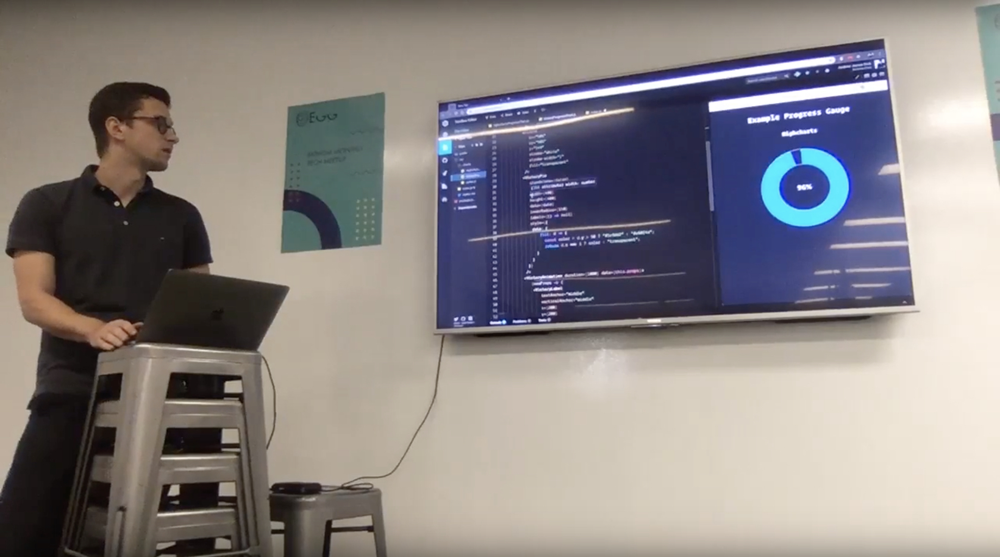
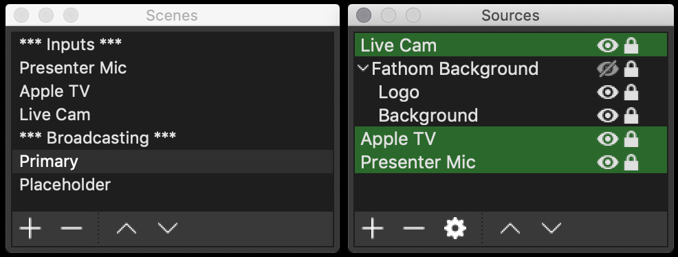
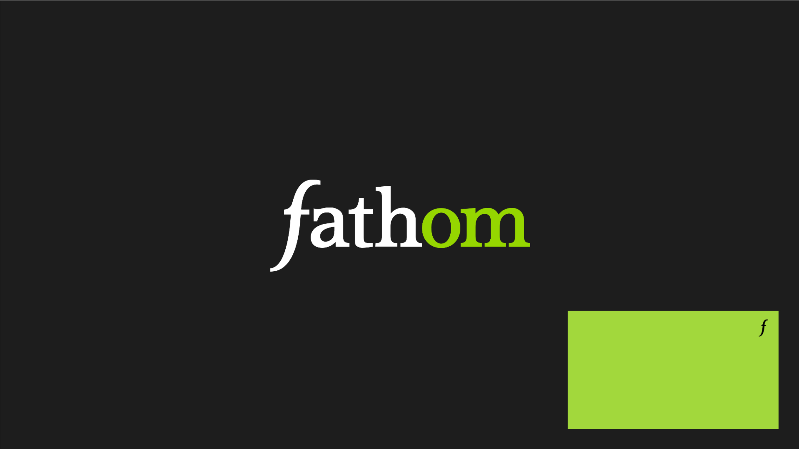
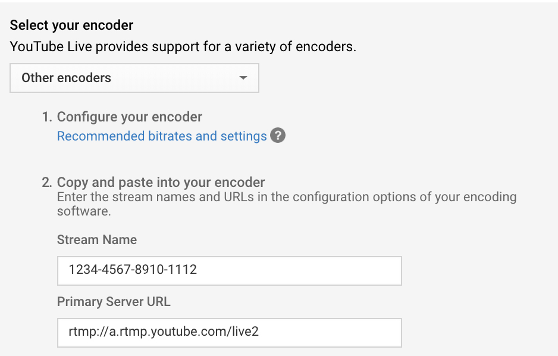
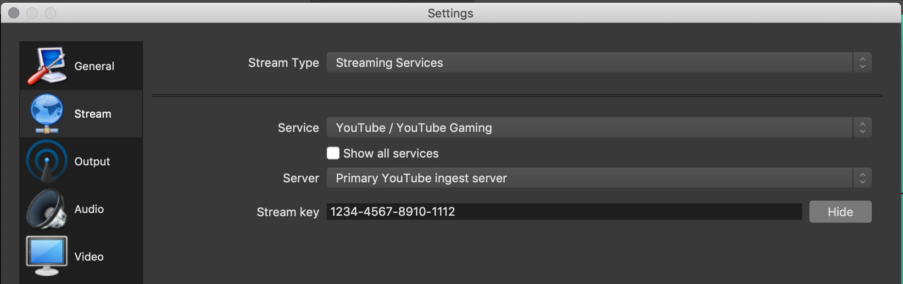

One of the favourite parts of my job is being surrounded by creative professionals who are keen to openly discuss ideas to further both their own and our collective understanding. Some have been a part of the industry for well over ten years and although they have certainly formulated their own opinions, they remain open to outside ideas and criticism to continually refine their professional outlook. Around one year ago a group of developers cobbled together the company’s first Egg talk; an in-house meet-up where developers could discuss anything they found interesting: project caveats, office diversity, upcoming technology, banana peeling techniques— anything, really. The talks were well received and events are now scheduled at least once per month with a handful of speakers at each, and have recently begun welcoming talks from other business disciplines.

Like most digital professions, remote work is now becomingly increasingly commonplace. The natural progression of the meet-up was to extend it to employees unable to attend the event for whatever reason. The original implementation involved recording the talks with a laptop perched on a coffee table facing the presenter and a television, which would then be uploaded to YouTube for later viewing. A means to an end, but not without its fair share of problems.

<figure>
	
  <figcaption>1.1: One of the original Egg talk recordings</figcaption>
</figure>

The laptop’s omnidirectional microphone made it difficult to focus the presenter’s voice and was prone to background noise. Glare on the television and an inconsistent refresh rate between it and the laptop’s camera could also make it difficult to see the presenter’s slides. Previous talks have also lasted over two hours; uploading and processing a file of that size means that remote viewers can’t watch the event until several hours later.

Ideally, those watching from outside the office should experience the same level of clarity as those sitting in the room. The challenge then lies in enhancing the quality of the live stream without compromising the experience of those attending in person. The simplest solution is to throw money at equipment to enhance the stream - a dedicated camera framed on the presenter, a wireless lapel microphone for each speaker, a digital mixing board to monitor and control the hardware, and so on. However, it’s difficult to justify the investment in equipment with no base for comparison or financial return for the business. The interim solution, therefore, is to demonstrate a progressive enhancement using existing technology that can serve as a baseline in determining any potential return from any further upgrades.

Our office’s ecosystem is heavily invested in Apple, so it made sense to attempt to leverage that technology. After all, Apple prides itself on the ‘it just works’ mantra between their devices. Four Apple devices were used to construct the live stream. The broadcast is primarily controlled on a MacBook Pro that uses broadcasting software with three audiovisual inputs: the output of an Apple TV displaying the presenter’s slides, an iPhone serving as the presenter’s microphone and another capturing a panoramic shot of the room.

Since it’s not currently possible to live stream via QuickTime, third-party broadcasting software is required. We chose the popular [Open Broadcaster Software](https://obsproject.com/) (OBS henceforth), but many other options are available. Like most streaming software, OBS is unable to accept the Apple TV as a direct input. Instead, we can open a new movie recording in Quicktime and select the Apple TV as the input. In OBS we can then import the movie recording as an input source. OBS also cannot directly access an iPhone’s microphone or camera without third-party support. To accept the microphone as an audio input capture source, the phone must be hardwired to the MacBook Pro and enabled as an input device in the Audio MIDI settings in the MacBook’s system preferences. An application that allows you to enable the microphone is also required on the iPhone (we used [VonBruno Microphone](https://apps.apple.com/us/app/microphone-vonbruno/id482337530) from the App Store). Another third-party App Store purchase, [EpocCam HD](https://apps.apple.com/us/app/epoccam-hd-webcam-for-mac-pc/id435355256), was used to provide OBS with an iPhone’s camera output. After downloading the EpocCam Viewer software, we can connect to any active EpocCam App on the same network and use the Viewer as a video capture device in OBS.

With the inputs configured, we constructed scenes in OBS and added the inputs as sources. In OBS, a source can be any audiovisual input. A scene is simply a collection of sources. To muddy the water somewhat, you can also add scenes as a source. I like to split my scenes into two distinct categories: input and broadcasting. A broadcasting scene is what the end user will eventually see on the live stream, and is composed of sources and input scenes. An input scene contains one of the hardware inputs and any related sources, which can then be imported into a broadcasting scene. Creating a scene for each input is similar to the grouping functionality within a scene, but it also allows you the ability to distribute the group across multiple scenes whilst retaining complete control from a single source of truth.

<figure>
	
  <figcaption>1.2: A list of scenes and sources in OBS (input scenes as sources are highlighted green)
 </figcaption>
</figure>

A list of scenes and the Primary scene’s sources in OBS (input scenes as sources are highlighted green)
The Primary broadcasting scene contains the live cam shot, the presenter’s slides and the microphone. For a touch of branding, a makeshift border background and a small logo were added to the live cam view, and a placeholder image of the company logo replaces the background shot whenever slides are unavailable. We also added a Placeholder scene for when the stream begins, ends, or during an intermission. This scene is a simple background image of our Egg poster with no audiovisual inputs.

<figure>
	
  <figcaption>1.3: Broadcasting scene overlay in OBS</figcaption>
</figure>

All that remains is somewhere to host the live stream. We chose YouTube, which required us to enable our account for live streaming. This was a one-time process and took around 24hours for YouTube to approve the request. Once enabled, an event was scheduled for the upcoming Egg talk. Events provide a greater degree of control over our broadcast in a number of ways. For instance, it generates an event URL that we can distribute ahead of time to anyone we’ve invited to watch the stream. A countdown to the scheduled start time will be displayed if the URL is accessed before the event has gone live. We can also restrict access to the event. We’ve chosen to host our talks privately (for now), which means the stream is only accessible by the host and those invited and will never show in search results or public playlists.
Default event settings and a reusable stream key were also configured. The default settings allow presets to be used for any future events, including privacy options, video categorisation, and advanced broadcasting configurations (stream optimisations, licensing and rights, etc). Doing so enforces consistency across the channel and ensures that any future events will require little to no setup before going live. To connect the event with our broadcasting software, we simply paste the reusable stream key and the server URL from the event into the OBS stream settings. Note that anyone with this key can stream to your channel, so it’s important to keep it secret and distribute with caution.

<figure>
	
  <figcaption>1.4: YouTube encoder settings</figcaption>
</figure>

<figure>
	
  <figcaption>1.5: OBS stream settings</figcaption>
</figure>

There were a number of compromises in achieving the end result. A thick red border appeared around the screen whenever a device was recording the Apple TV’s output. This did not show on the live stream but was visible to those in the room looking at the screen. A notification also appeared on the top right corner of the screen displaying the device recording the output, which was visible on both the television and the live stream. Since the camera is connected over wifi via a third-party application, it introduced approximately two seconds of latency between the live cam shot and the presenter’s voice and slides. It’s arguably the least important input of the three, but still contributed to reducing the overall quality of the stream.

With that in mind, the stream still provided a noticeable improvement in quality from the initial talks. The event is now immediately available to anyone with permission and access to the link and YouTube automatically archives the broadcast for later viewing. The presenter’s voice is clearer and the background noise has faded since the microphone faces away from the audience. The slides are now the broadcast’s focal point which can be seen without any visual impairment, and the camera gives viewers a feel for the room. Further refinements are certainly achievable with some modest upgrades; the benefits of which remain to be seen.

<iframe width="560" height="315" src="https://www.youtube.com/embed/hX_pJPaqVSA" title="Egg livestream" frameborder="0" allow="accelerometer; autoplay; encrypted-media; gyroscope; picture-in-picture" allowfullscreen />
