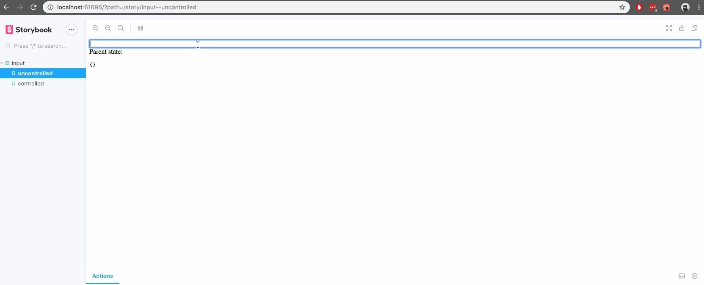

Storybook is an incredible open-source sandbox for developing UI components in isolation. One of my current projects is a large multi-screen form with various controlled components that rely on their parent container as the single source of truth. I found that while Storybook is great for testing individual component state, I was writing boilerplate code in each of the stories where a controlled component passed state to a parent container.

```jsx
/* src/stories/index.js */
import React, { useState } from 'react';
import { storiesOf } from '@storybook/react';

storiesOf('Input', module).add('controlled', () => {
  function Parent({ children, ...props }) {
    const [state, setState] = useState();
    return <div>{children(state, setState)}</div>;
  }

  return (
    <Parent>
      {(state, setState) => (
        <input
          value={state.value}
          onChange={e => setState({ value: e.target.value })}
        />
      )}
    </Parent>
  );
});
```

This parent component could easily be abstracted and imported into relevant stories, but since each story is effectively a render function you would ideally pass the state variables through as arguments, i.e.

```jsx
/* src/stories/index.js */
import React, { useState } from "react";
import { storiesOf } from "@storybook/react";

storiesOf("Input", module).add("controlled", (state, setState) => (
  <input
    value={state.value}
    onChange={e => setState({ value: e.target.value })}
  />
);
```

This can be achieved by creating two components and a custom decorator in the .storybook/config.js file. The first component is a function as child that emulates the parent component from the first example by acting as a render callback. The second is a presentation component that receives the state as a prop and displays the current value below each story. The custom decorator augments each story with these components and the state variables, where the components will wrap the story and the state values will be passed through as arguments.

```jsx
/* .storybook/config.js */
import React, { useState } from "react";
import { configure, addDecorator } from "@storybook/react";

function loadStories() {
  require("../src/stories/index.js");
}

// Component 1
function Stage({ children, …props }) {
  const [state, setState] = useState({});
  return <div {…props}>{children(state, setState)}</div>;
}

// Component 2
function State({ state, …props }) {
  return (
    <div {…props}>
      Parent state: <pre>{JSON.stringify(state)}</pre>
    </div>
  );
}

// Custom decorator
addDecorator(story => (
  <Stage>
    {(state, setState) => (
      <div style={{ display: "flex", flexFlow: "column" }}>
       {story(state, setState)}
       <State state={state} />
      </div>
    )}
  </Stage>
));

configure(loadStories, module);
```

Now each component has the option of setting and retrieving hoisted state values from the story itself without any boilerplate code 💥

```jsx
/* src/stories/index.js */
import React from 'react';
import { storiesOf } from '@storybook/react';

storiesOf('Input', module)
  // stateless
  .add('uncontrolled', () => <input />)

  // stateful
  .add('controlled', (state, setState) => (
    <input
      value={state.value}
      onChange={e => setState({ value: e.target.value })}
    />
  ));
```

You can find the repository on GitHub, and here’s a quick look at it in action:



<figcaption>1.1: Test both controlled and uncontrolled inputs in Storybook</figcaption>
